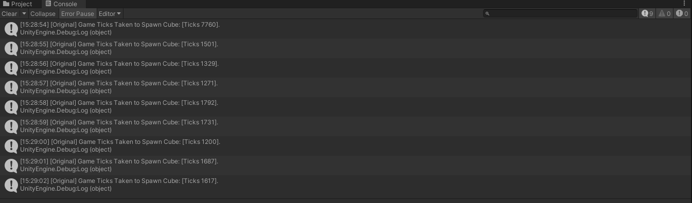
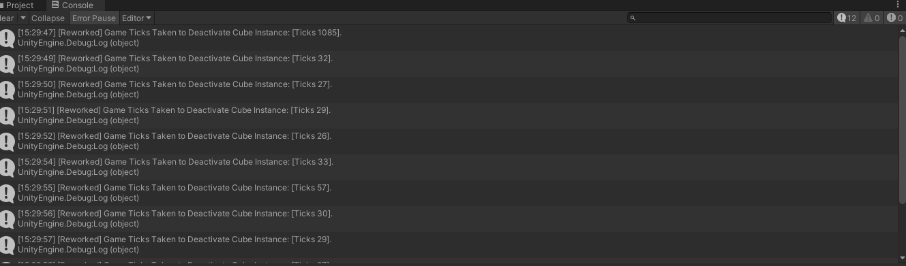
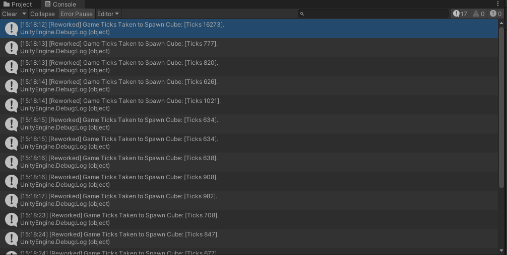
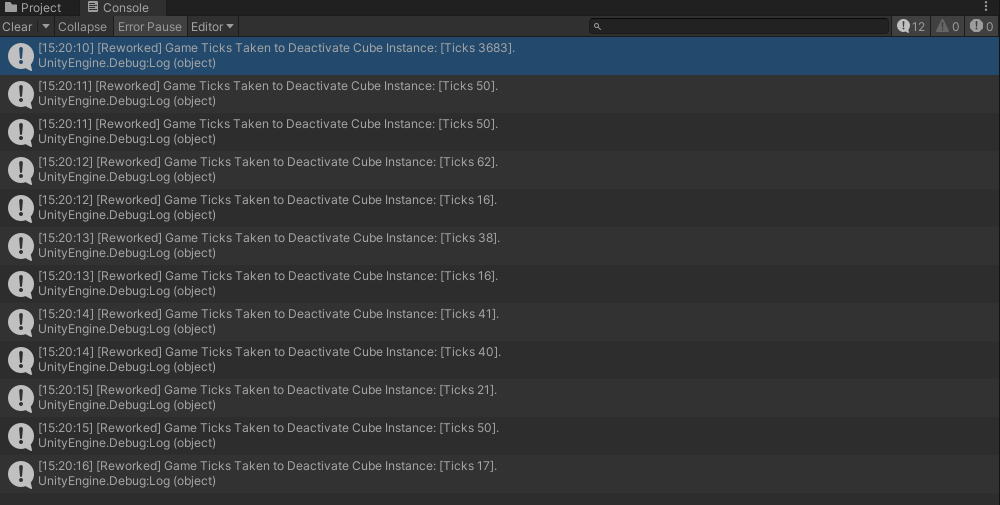
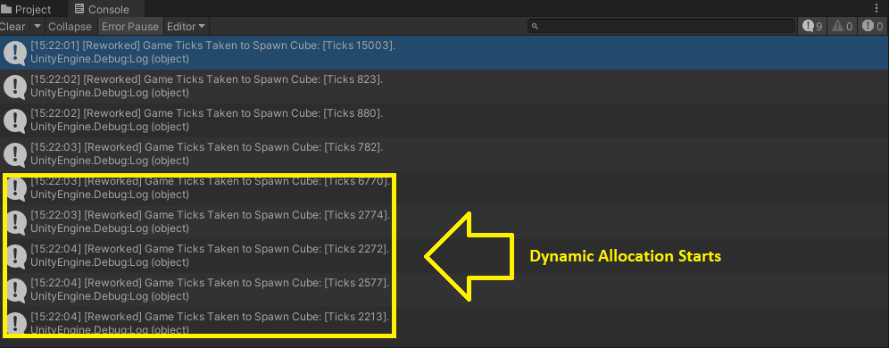

# Kurechii Technical Assessment
Evaluator: Mr Shin Hean Kung, Kurechii Technical Director.
Candidate: Mr Leow Kean Tat aka Kaz.

## Assessment Objectives
Note: Taken from the original assessment document.
> The objective of this assessment is to evaluate the candidate's ability to read the requirements, implement the necessary modifications, optimize the code while maintaining readability, and provide documentation showcasing the improvements made.

## How-To-Use
In the active scene, choose between activating the **Cube Unit Test.cs** script from either the **Unit Test (Original)** or **Unit Test (Reworked)** Game Object. Keep in mind that a high **Number of Units** count would cause the scene to significantly take longer to start up.

Scene File Path:
+ `Assets/Scenes/SampleScene.unity`

## Highlighted Changes

1. The **code segment** used for **cube spawns and despawns**.
- OLD: Heavily relied on **object creation** and **destruction** on demand.
- NEW: Uses a dynamically sized Object Pooling System.

Related New Asset Files:
+ `Assets/Scripts/Systems/ObjectPool.cs` - Containing the active/inactive list of instances. This will also be where developers can adjust the pool size.
+ `Assets/Scripts/Systems/ObjectPoolDefinitions.cs` - Containing static definitions for creating the objects. The aforementioned `ObjectPool.cs` script heavily relies on this.
+ `Assets/Scripts/Systems/PooledObject.cs` - The **marker** script to help the pool identify where its instances are. Once the component's Game Object is deactivated, it will automatically return to its *home*.

2. Added a singleton class, which purpose is to **prepare wrapper functions** to call the stopwatch checks. Its current use cases are to compare the performance benchmarks during **cube activation and deactivation**.

File Path:
+ `Assets/Scripts/Managers/DiagnosticsManager.cs`

3. Added a new `Cube` script to store its **lifespan duration** value and handle self-deactivation logic.

File Path:
+ `Assets/Scripts/Cube/02_Reworked/Cube.cs`

## Performance Benchmarks

1. On-Demand Creation Benchmark

2. On-Demand Destruction Benchmark

3. Object Pool Creation (Static Pool) Benchmark

4. Object Pool Destruction Benchmark

5. Object Pool Creation (Dynamic Pool Expansion) Benchmark

## Conclusion
It has been found that both have its **pros and cons**. **Object Pooling** demands a **high upfront memory intake** to preserve the existence of all pooled objects while giving players and developers the benefit of **reduced processing time** (by around **~30%** at worst case, **~50%** at best case, as of this project's context). The **on-demand** creation and destruction should only be used if the amount required is significantly small and a tight schedule has to be met. Otherwise, in almost all scenarios, a properly implemented object pooling system's benefits would always outweigh its costs, in the long term.

## References
- ReadOnly Attribute
https://www.patrykgalach.com/2020/01/20/readonly-attribute-in-unity-editor/
